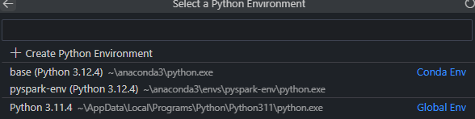
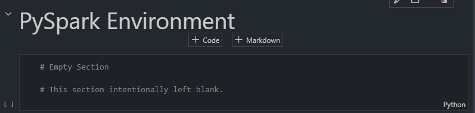

# 💻Training Session: Leveraging GitHub Copilot for Data Engineering

## Introduction

During this live hands-on session, participants will experience how GitHub Copilot can assist in boosting their data engineering workflows. The session will demonstrate essential data engineering processes using Python, Apache Spark, and SQL, all within Jupyter Notebooks in VS Code. Participants will also learn how GitHub Copilot can assist in generating queries and documentation.

## 🎯Objectives

- Ingest data from multiple sources using Apache Spark.
- Transform data using PySpark and pandas.
- Load data into a SQL database.
- Generate SQL queries with the assistance of GitHub Copilot.
- Use GitHub Copilot to assist in writing code and generating documentation.
- Share the context of previous development and collaborate using GitHub Copilot Chat.

## ℹ️Requirements

- Conda (Miniconda or Anaconda).
- VS Code version with Jupyter and GitHub Copilot Extensions enabled.
- Apache Spark setup.
- SQL Database (PostgreSQL, MySQL, etc.) installed.
- SQLAlchemy and other necessary Python packages installed.

## Before starting the activity: Clone the repository

## RDD Operations

### Step 1: Create RDD Operations File and Set PySpark environment

Use the `/newNotebook` to create an empty jupyter notebook.

👤 Prompt:

```
@workspace /newNotebook Create a jupyter notebook with no content
```


Rename the file to `RDD-Operations.ipynb` and move it to `notebooks` folder

Select Kernel with the anaconda environment previously created




### Set title to `PySpark Environment`



```python
# Set environment variables for PySpark
# The variables should configure Spark home, Jupyter as the driver, and Python as the interpreter.
# Additionally, ensure that Jupyter notebook is used as the driver environment.

import os
os.environ['SPARK_HOME'] = "<Set the anaconda env with the spark setup>"
os.environ['PYSPARK_DRIVER_PYTHON'] = 'jupyter'
os.environ['PYSPARK_DRIVER_PYTHON_OPTS'] = 'notebook'
os.environ['PYSPARK_PYTHON'] = 'python'
```

### Step 2: Initialize Spark Session

Tell to copilot to import and initialize Spark Session and then to create a Spark Session using comment driven development

```python
# Import Spark Session from pyspark.sql

from pyspark.sql import SparkSession

# Create a SparkSession
spark = SparkSession.builder.appName('SparkRDD').getOrCreate()
```

### Step 3: Creating RDD from a list

Create a title `Creating RDDs` and then a subtitle `Creating RDD from a list`


```python

# Create a RDD from a number list from 1 to 10
data = [1, 2, 3, 4, 5, 6, 7, 8, 9, 10]
rdd = spark.sparkContext.parallelize(data)

# Perform a collect action to view the data
rdd.collect()
```

### Step 4: Creating RDD from a list of tuples

```python
# Create an RDD from a list of tuples with name and age between 20 and 49
data = [('John', 25), ('Lisa', 28), ('Saul', 49), ('Maria', 35), ('Lee', 40)]
rdd = spark.sparkContext.parallelize(data)

# Perform a collect action to see the data
rdd.collect()
```

### Step 5: RDD Map Transformation

Create a title `RDDs Transformations` and then a subtitle `Map Transformation`

```python
# Map transformation: Convert name to uppercase
mappedData = rdd.map(lambda x: (x[0].upper(), x[1]))

# Perform a collect action to see the data
mappedData.collect()

```

### Step 6: RDD Filter Transformation

Create a subtitle `Filter Transformation`

```python
# Filter transformation: Filter records with age greater than 30
filteredData = rdd.filter(lambda x: x[1] > 30)

# Perform a collect action to see the data
filteredData.collect()
```

### Step 7: RDD ReduceByKey Transformation

Create a subtitle `ReduceByKey Transformation`

Ask to GitHub Copilot Chat to give you an example of RDD ReduceByKey transformation

👤Prompt:

```
Please give me an example of RDD reduce by key transforamation, use spark session and take as reference the file #file:RDD-Operations.ipynb
```

🤖 Copilot Answer:

```python
# Set environment variables for PySpark
import os

os.environ['SPARK_HOME'] = 'C:/Users/saulr/Documents/CURSOS/PYSPARK/.pyspark-env/Lib/site-packages/pyspark'
os.environ['PYSPARK_DRIVER_PYTHON'] = 'jupyter'
os.environ['PYSPARK_DRIVER_PYTHON_OPTS'] = 'notebook'
os.environ['PYSPARK_PYTHON'] = 'python'

# Import Spark Session from pyspark.sql
from pyspark.sql import SparkSession

# Create a SparkSession
spark = SparkSession.builder.appName('SparkRDD').getOrCreate()

# Create an RDD from a list of tuples with name and age
data = [('John', 25), ('Lisa', 28), ('Saul', 49), ('Maria', 35), ('Lee', 40), ('John', 30), ('Lisa', 25)]
rdd = spark.sparkContext.parallelize(data)

# ReduceByKey: Calculate the total age for each name
reducedData = rdd.reduceByKey(lambda x, y: x + y)

# Perform a collect action to see the data
result = reducedData.collect()
print(result)
```

> ⚠️ We are going to take only the code block we need.

```python
data = [('John', 25), ('Lisa', 28), ('Saul', 49), ('Maria', 35), ('Lee', 40), ('John', 30), ('Lisa', 25)]
rdd = spark.sparkContext.parallelize(data)

# ReduceByKey: Calculate the total age for each name
reducedData = rdd.reduceByKey(lambda x, y: x + y)

# Perform a collect action to see the data
reducedData.collect()
```

### Step 8: RDD Sorty By Transformation

Create a subtitle `SortBy Transformation`

```python
# SortyBy Transformation: Sort the data by age in descending order
sortedData = reducedData.sortBy(lambda x: x[1], ascending=False)

# Perform a collect action to see the data
sortedData.collect()
```

## DataFrame Operations

### Step 1: Create DataFrame Operations File and Set PySpark environment

Tell to copilot to create a new notebook

👤 Prompt:

```
@workspace /newNotebook Generate a jupyter notebook with 1 cell with the title "PySpark Environment"
```

Rename the created file to `DataFrame-Operations.ipynb` and save it to notebooks folder.

Set the spark setup

```python

import os
os.environ['SPARK_HOME'] = "<Set the anaconda env with the spark setup>"
os.environ['PYSPARK_DRIVER_PYTHON'] = 'jupyter'
os.environ['PYSPARK_DRIVER_PYTHON_OPTS'] = 'lab'
os.environ['PYSPARK_PYTHON'] = 'python'
```

### Step 2: Initialize Spark Session

Tell to copilot to import and initialize Spark Session and then to create a Spark Session using comment driven development

```python
# Import PySpark and initialize SparkSession
from pyspark.sql import SparkSession

# Create a SparkSession
spark = SparkSession.builder.appName('SparkSQL').getOrCreate()
```

### Step 3: Read CSV File into DataFrame

#### Read CSV with header

```python
# Read CSV file into DataFrame
# Use ../data/products.csv file with header
csv_file = '../data/products.csv'
df = spark.read.csv(csv_file, header=True, inferSchema=True)

# Show the DataFrame schema
df.printSchema()

# Show the first 20 rows
df.show()
```

#### Read CSV with an explicit schema definition

```python
# Import the necessary types
from pyspark.sql.types import StructType, StructField, IntegerType, StringType, FloatType

# Define a new schema
schema = StructType([
    StructField('product_id', IntegerType(), False),
    StructField('product_name', StringType(), False),
    StructField('product_category_id', IntegerType(), False),
    StructField('product_description', StringType(), True),
    StructField('product_price', FloatType(), False)
])

# Load the data with the new schema
df = spark.read.csv(csv_file, header=True, schema=schema)

# Show the DataFrame schema
df.printSchema()

# Show the first 20 rows
df.show()

```

### Step 4: Read JSON File into DataFrame

#### Single line JSON

```python
# Read single line JSON
# Each row is a JSON record, records are separated by new line
json_file = '../data/products_singleline.json'
df = spark.read.json(json_file)

# Show the DataFrame schema
df.printSchema()

# Show the first 20 rows
df.show()
```

#### Multi-lines JSON

```python
# Read multi-line JSON
# Use spark json method to read multi-line JSON with multiline option
json_file = '../data/products_multiline.json'
df = spark.read.json(json_file, multiLine=True)

# Show the DataFrame schema
df.printSchema()

# Show the first 20 rows
df.show()
```

### Step 5: DataFrame Operations

#### Loading the syntethic data into DataFrame

```python
# Load the synthetic data into a DataFrame
# Read with spark csv method
synthetic_file = '../data/stocks.txt'
df = spark.read.csv(synthetic_file, header=True, inferSchema=True)

# Show the DataFrame schema
df.printSchema()

# Show the first 20 rows
df.show()
```

#### Select: Choose specific columns

```python
# Select specific columns from the DataFrame: name, category, and price
df.select('name', 'category', 'price').show()
```

#### Filter: Apply conditions to filter rows

```python
# Filter rows based on a condition using filter method
df.filter(df['price'] > 100).show()
```

#### GroupBy: Group data based on specific columns

```python
# Group by category and count the number of products in each category
df.groupBy('category').count().show()

# Add aggregation like sum, avg, max, min, etc.
df.groupBy('category').agg({'price': 'avg'}).show()
```

#### Join: Combine multiple DataFrames based on specified columns

```python
# Join with another DataFrame. Create this new DF by filtering the original DF
df2 = df.filter(df['price'] > 100)

# Join the two DataFrames
df.join(df2, on='category', how='inner').show()
```

#### WithColumn: Add new calculated columns

```python
# Add a new calculated column
df.withColumn('price_after_tax', df['price'] * 1.1).show()
```

## Spark SQL

### Step 1: Create Spark SQL File and Set PySpark environment

Create a file called `Spark-SQL.ipynb` in a notebooks folder at root of your project.

```python
# Set PySpark environment
# Use the conda environment
import os
os.environ['SPARK_HOME'] = ".../PYSPARK/Spark"
os.environ['PYSPARK_DRIVER_PYTHON'] = 'jupyter'
os.environ['PYSPARK_DRIVER_PYTHON_OPTS'] = 'lab'
os.environ['PYSPARK_PYTHON'] = 'python'
```

### Step 2: Initialize Spark Session

Tell to copilot to import and initialize Spark Session and then to create a Spark Session using comment driven development

```python
# Import PySpark and initialize SparkSession
from pyspark.sql import SparkSession

# Create a SparkSession
spark = SparkSession.builder.appName('SparkSQL').getOrCreate()
```

### Step 3: Load Data into a DataFrame

```python
# Load the synthetic data into a DataFrame
data_file = '../data/persons.csv'
persons_df = spark.read.csv(data_file, header=True, inferSchema=True)

# Show the schema of the DataFrame
persons_df.printSchema()

# Show the first 5 rows of the DataFrame
persons_df.show(5)
```

### Step 4: Register the DataFrame as a Temporary Table

```python
# Register the DataFrame as a Temporary Table
persons_df.createOrReplaceTempView('persons')
```

### Step 5: Perform SQL-like **Queries**

```python
# Select all rows where age is greater than 25
query = 'SELECT * FROM persons WHERE age > 25'
persons_df_greater_than_25 = spark.sql(query)
persons_df_greater_than_25.show()

# Compute the average salary of persons
query = 'SELECT AVG(salary) AS avg_salary FROM persons'
avg_salary = spark.sql(query)
avg_salary.show()
```

### Step 6: Managing temporary views

```python
# Check if a temporary view exists
if spark.catalog._jcatalog.tableExists('persons'):
    print('The temporary view persons exists')

# Drop the temporary view
spark.catalog.dropTempView('persons')

# Check if a temporary view exists
if spark.catalog._jcatalog.tableExists('persons'):
    print('The temporary view persons exists')
```

### Step 7: Sub Queries

```python
# Create two DataFrames
# The first DataFrame contains employee data with columns: id, name
# The second DataFrame contains salary data with columns: id, salary, department
data1 = [(1, 'John'), (2, 'Jane'), (3, 'Alice')]
data2 = [(1, 1000, 'HR'), (2, 1500, 'Engineering'), (3, 1200, 'Marketing')]
columns1 = ['id', 'name']
columns2 = ['id', 'salary', 'department']
df1 = spark.createDataFrame(data1, columns1)
df2 = spark.createDataFrame(data2, columns2)

# Show the first DataFrame
df1.show()

# Show the second DataFrame
df2.show()
```

```python
# Register as temporary views
df1.createOrReplaceTempView('employees')
df2.createOrReplaceTempView('salaries')
```

```python
# Subquery to find employees with salaries above average
query = '''
SELECT e.name, s.salary
FROM employees e
JOIN salaries s
ON e.id = s.id
WHERE s.salary > (SELECT AVG(salary) FROM salaries)
'''
result = spark.sql(query)
result.show()
```

#### Resources

1. https://www.oreilly.com/library/view/prompt-engineering-for/9781098153427/
