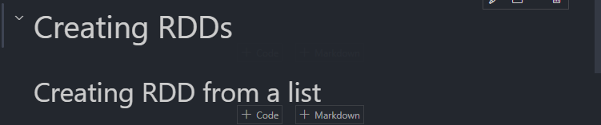
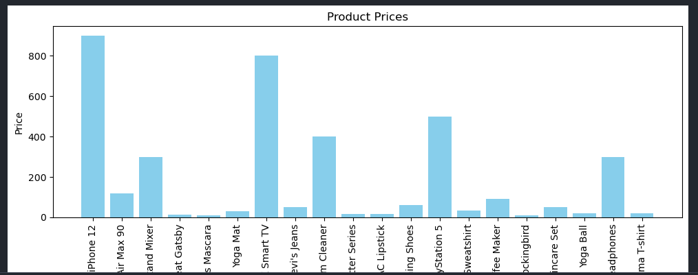

# 💻Training Session: Leveraging GitHub Copilot for Data Engineering

## Introduction

During this live hands-on session, participants will experience how GitHub Copilot can assist in boosting their data engineering workflows. The session will demonstrate essential data engineering processes using Python, Apache Spark, and SQL, all within Jupyter Notebooks in VS Code. Participants will also learn how GitHub Copilot can assist in generating queries and documentation.

## 🎯Objectives

- Ingest data from multiple sources using Apache Spark.
- Transform data using PySpark and pandas.
- Load data into a SQL database.
- Generate SQL queries with the assistance of GitHub Copilot.
- Use GitHub Copilot to assist in writing code and generating documentation.
- Share the context of previous development and collaborate using GitHub Copilot Chat.

## ℹ️Requirements

- Conda (Miniconda or Anaconda).
- VS Code version with Jupyter and GitHub Copilot Extensions enabled.
- Apache Spark setup.
- SQL Database (PostgreSQL, MySQL, etc.) installed.
- SQLAlchemy and other necessary Python packages installed.

## Before starting the activity: Clone the repository

## RDD Operations

### Step 1: Create RDD Operations File and Set PySpark environment

Use the `/newNotebook` to create an empty jupyter notebook.

👤 Prompt:

```
@workspace /newNotebook Create a jupyter notebook with no content
```


Rename the file to `RDD-Operations.ipynb` and move it to `notebooks` folder

Select Kernel with the anaconda environment previously created


### Set title to `PySpark Environment`


```python
# Set environment variables for PySpark
# The variables should configure Spark home, Jupyter as the driver, and Python as the interpreter.
# Additionally, ensure that Jupyter notebook is used as the driver environment.

import os
os.environ['SPARK_HOME'] = "<Set the anaconda env with the spark setup>"
os.environ['PYSPARK_DRIVER_PYTHON'] = 'jupyter'
os.environ['PYSPARK_DRIVER_PYTHON_OPTS'] = 'notebook'
os.environ['PYSPARK_PYTHON'] = 'python'
```

### Step 2: Initialize Spark Session

Tell to copilot to import and initialize Spark Session and then to create a Spark Session using comment driven development

```python
# Import Spark Session from pyspark.sql

from pyspark.sql import SparkSession

# Create a SparkSession
spark = SparkSession.builder.appName('SparkRDD').getOrCreate()
```

### Step 3: Creating RDD from a list

Create a title `Creating RDDs` and then a subtitle `Creating RDD from a list`



```python

# Create a RDD from a number list from 1 to 10
data = [1, 2, 3, 4, 5, 6, 7, 8, 9, 10]
rdd = spark.sparkContext.parallelize(data)

# Perform a collect action to view the data
rdd.collect()
```

### Step 4: Creating RDD from a list of tuples

```python
# Create an RDD from a list of tuples with name and age between 20 and 49
data = [('John', 25), ('Lisa', 28), ('Saul', 49), ('Maria', 35), ('Lee', 40)]
rdd = spark.sparkContext.parallelize(data)

# Perform a collect action to see the data
rdd.collect()
```

### Step 5: RDD Map Transformation

Create a title `RDDs Transformations` and then a subtitle `Map Transformation`

```python
# Map transformation: Convert name to uppercase
mappedData = rdd.map(lambda x: (x[0].upper(), x[1]))

# Perform a collect action to see the data
mappedData.collect()

```

### Step 6: RDD Filter Transformation

Create a subtitle `Filter Transformation`

```python
# Filter transformation: Filter records with age greater than 30
filteredData = rdd.filter(lambda x: x[1] > 30)

# Perform a collect action to see the data
filteredData.collect()
```

### Step 7: RDD ReduceByKey Transformation

Create a subtitle `ReduceByKey Transformation`

Ask to GitHub Copilot Chat to give you an example of RDD ReduceByKey transformation

👤Prompt:

```
Please give me an example of RDD reduce by key transforamation, use spark session and take as reference the file #file:RDD-Operations.ipynb
```

🤖 Copilot Answer:

```python
# Set environment variables for PySpark
import os

os.environ['SPARK_HOME'] = 'C:/Users/saulr/Documents/CURSOS/PYSPARK/.pyspark-env/Lib/site-packages/pyspark'
os.environ['PYSPARK_DRIVER_PYTHON'] = 'jupyter'
os.environ['PYSPARK_DRIVER_PYTHON_OPTS'] = 'notebook'
os.environ['PYSPARK_PYTHON'] = 'python'

# Import Spark Session from pyspark.sql
from pyspark.sql import SparkSession

# Create a SparkSession
spark = SparkSession.builder.appName('SparkRDD').getOrCreate()

# Create an RDD from a list of tuples with name and age
data = [('John', 25), ('Lisa', 28), ('Saul', 49), ('Maria', 35), ('Lee', 40), ('John', 30), ('Lisa', 25)]
rdd = spark.sparkContext.parallelize(data)

# ReduceByKey: Calculate the total age for each name
reducedData = rdd.reduceByKey(lambda x, y: x + y)

# Perform a collect action to see the data
result = reducedData.collect()
print(result)
```

> ⚠️ We are going to take only the code block we need.

```python
data = [('John', 25), ('Lisa', 28), ('Saul', 49), ('Maria', 35), ('Lee', 40), ('John', 30), ('Lisa', 25)]
rdd = spark.sparkContext.parallelize(data)

# ReduceByKey: Calculate the total age for each name
reducedData = rdd.reduceByKey(lambda x, y: x + y)

# Perform a collect action to see the data
reducedData.collect()
```

### Step 8: RDD Sorty By Transformation

Create a subtitle `SortBy Transformation`

```python
# SortyBy Transformation: Sort the data by age in descending order
sortedData = reducedData.sortBy(lambda x: x[1], ascending=False)

# Perform a collect action to see the data
sortedData.collect()
```

## DataFrame Operations

### Step 1: Create DataFrame Operations File and Set PySpark environment

Tell to copilot to create a new notebook

👤 Prompt:

```
@workspace /newNotebook Generate a jupyter notebook with 1 cell with the title "PySpark Environment"
```

Rename the created file to `DataFrame-Operations.ipynb` and save it to notebooks folder.

Set the spark setup

```python

import os
os.environ['SPARK_HOME'] = "<Set the anaconda env with the spark setup>"
os.environ['PYSPARK_DRIVER_PYTHON'] = 'jupyter'
os.environ['PYSPARK_DRIVER_PYTHON_OPTS'] = 'lab'
os.environ['PYSPARK_PYTHON'] = 'python'
```

### Step 2: Initialize Spark Session

Tell to copilot to import and initialize Spark Session and then to create a Spark Session using comment driven development

```python
# Import PySpark and initialize SparkSession
from pyspark.sql import SparkSession

# Create a SparkSession
spark = SparkSession.builder.appName('SparkSQL').getOrCreate()
```

### Step 3: Read CSV File into DataFrame

Create a title `Read CSV file into DataFrame` and subtitle `Read CSV with header`

#### Read CSV with header

Tell to copilot how to read a csv file into a DataFrame

👤Prompt:

```
@workspace I want to read a csv file into a Dataframe, then print the dataframe schema and show the data. The file to read is #file:products.csv
```

🤖 Copilot Chat Answer:

```python
from pyspark.sql import SparkSession

# Initialize SparkSession
spark = SparkSession.builder.appName('ProductsDataFrame').getOrCreate()

# Read the CSV file into a DataFrame
df = spark.read.csv('data/products.csv', header=True, inferSchema=True)

# Print the DataFrame schema
df.printSchema()

# Show the data
df.show()
```

> ℹ️ We use only the code we need and set the correct path to the file.

```python
# Read the CSV file into a DataFrame
df = spark.read.csv('../data/products.csv', header=True, inferSchema=True)

# Print the DataFrame schema
df.printSchema()

# Show the data
df.show()
```

#### Read CSV with an explicit schema definition

Create a subtitle `Read CSV with an explicit schema definition`

Tell to copilot to read the same file but in this case with an explicit schema definition

👤 Prompt:

```
@workspace now read the same file but in this case with an explicit schema definition
```

🤖 Copilot Chat Answer:

```python
from pyspark.sql import SparkSession
from pyspark.sql.types import StructType, StructField, IntegerType, StringType, DoubleType

# Initialize SparkSession
spark = SparkSession.builder.appName('ProductsDataFrame').getOrCreate()

# Define the schema explicitly
schema = StructType([
    StructField("id", IntegerType(), True),
    StructField("name", StringType(), True),
    StructField("category", StringType(), True),
    StructField("quantity", IntegerType(), True),
    StructField("price", DoubleType(), True)
])

# Read the CSV file into a DataFrame with the explicit schema
df = spark.read.csv('../data/products.csv', header=True, schema=schema)

# Print the DataFrame schema
df.printSchema()

# Show the data
df.show()

```

> ℹ️ We use only the code we need and set the correct path to the file.

```python
from pyspark.sql.types import StructType, StructField, IntegerType, StringType, DoubleType

# Define the schema explicitly
schema = StructType([
    StructField("id", IntegerType(), True),
    StructField("name", StringType(), True),
    StructField("category", StringType(), True),
    StructField("quantity", IntegerType(), True),
    StructField("price", DoubleType(), True)
])

# Read the CSV file into a DataFrame with the explicit schema
df = spark.read.csv('../data/products.csv', header=True, schema=schema)

# Print the DataFrame schema
df.printSchema()

# Show the data
df.show()
```

### Step 4: Read JSON File into DataFrame

Create a title `Read JSON File into DataFrame` and subtitle `Single line JSON`

#### Single line JSON

Tell to copilot how to read a single line JSON file into Dataframe

👤 Prompt:

```
@workspace how to read a single line JSON into Dataframe and print the dataframe schema and data. The file to read is #file:products_singleline.json
```

🤖 Copilot Chat Answer:

```python
from pyspark.sql import SparkSession

# Initialize SparkSession
spark = SparkSession.builder.appName('ProductsDataFrame').getOrCreate()

# Read the single-line JSON file into a DataFrame
df = spark.read.json('data/products_singleline.json')

# Print the DataFrame schema
df.printSchema()

# Show the data
df.show()
```

> ℹ️ Set the correct path to the file

#### Multi-lines JSON

Create a subtitle `Multi-lines JSON`

Tell to copilot how to read multi line JSON file into dataframe.

👤 Prompt:

```
@workspace how to read a multiline json file into dataframe and print the dataframe schema and data. The file to read #file:products_multiline.json
```

🤖 Copilot Chat Answer:

```python
from pyspark.sql import SparkSession

# Initialize SparkSession
spark = SparkSession.builder.appName('ProductsDataFrame').getOrCreate()

# Read the multi-line JSON file into a DataFrame
df = spark.read.json('data/products_multiline.json', multiLine=True)

# Print the DataFrame schema
df.printSchema()

# Show the data
df.show()
```

> ℹ️ Set the correct path to the file

```python
# Read multi-line JSON
# Use spark json method to read multi-line JSON with multiline option
json_file = '../data/products_multiline.json'
df = spark.read.json(json_file, multiLine=True)

# Show the DataFrame schema
df.printSchema()

# Show the first 20 rows
df.show()
```

### Step 5: Creating a Bar Chart

Create a subtitle `Creating a barchart`

Tell to copilot how to create a barchart using pandas dataframe

👤Prompt:

```
@workspace How to convert a dataframe to pandas dataframe and then create a bar chart with the product prices use matplotlib
```

🤖 Copilot Chat Answer:

```python
import matplotlib.pyplot as plt

# Assuming you have already read the JSON file into a PySpark DataFrame
df = spark.read.json('../data/products_singleline.json')

# Convert the PySpark DataFrame to a Pandas DataFrame
pandas_df = df.toPandas()

# Create a bar chart with product prices
plt.figure(figsize=(10, 6))
plt.bar(pandas_df['name'], pandas_df['price'], color='skyblue')
plt.xlabel('Product Name')
plt.ylabel('Price')
plt.title('Product Prices')
plt.xticks(rotation=90)
plt.tight_layout()

# Show the plot
plt.show()
```



### Step 6: DataFrame Operations

Create a title `DataFrame Operations` and subtitle `Loading the syntethic data into DataFrame`

#### Loading the syntethic data into DataFrame

Tell to copilot to read syntethic file `stocks.txt` into dataframe

👤 Prompt:

```
@workspace Read this syntethic file into dataframe, print the schema and data. The file is #file:stocks.txt
```

🤖 Copilot Chat Answer:

```python
from pyspark.sql import SparkSession

# Initialize SparkSession
spark = SparkSession.builder.appName('StocksDataFrame').getOrCreate()

# Read the CSV file into a DataFrame
df = spark.read.csv('data/stocks.txt', header=True, inferSchema=True)

# Print the DataFrame schema
df.printSchema()

# Show the data
df.show()
```

> ℹ️ Set the correct path to the file

#### Select: Choose specific columns

Create subtitle `Select: Choose specific columns`

```python
# Select specific columns from the DataFrame: name, category, and price
df.select('name', 'category', 'price').show()
```

#### Filter: Apply conditions to filter rows

Create subtitle `Filter: Apply conditions to filter rows`

```python
# Filter rows based on a condition using filter method
df.filter(df['price'] > 100).show()
```

#### GroupBy: Group data based on specific columns

Create subtitle `GroupBy: Group data based on specific columns`

```python
# Group by category and count the number of products in each category
df.groupBy('category').count().show()

# Add aggregation like sum, avg, max, min, etc.
df.groupBy('category').agg({'price': 'avg'}).show()
```

#### Join: Combine multiple DataFrames based on specified columns

Create subtitle `Join: Combine multiple DataFrames based on specified columns`

```python
# Join with another DataFrame. Create this new DF by filtering the original DF
df2 = df.filter(df['price'] > 100)

# Join the two DataFrames
df.join(df2, on='category', how='inner').show()
```

#### WithColumn: Add new calculated columns

Create subtitle `WithColumn: Add new calculated columns`

```python
# Add a new calculated column
df.withColumn('price_after_tax', df['price'] * 1.1).show()
```

## Spark SQL

### Step 1: Create Spark SQL File and Set PySpark environment

Tell to copilot to create a new notebook

👤 Prompt:

```
@workspace /newNotebook Generate a jupyter notebook with 1 cell with the title "PySpark Environment"
```

Rename the created file to `Spark-SQL.ipynb` and save it to notebooks folder.

Set the spark setup

```python

import os
os.environ['SPARK_HOME'] = "<Set the anaconda env with the spark setup>"
os.environ['PYSPARK_DRIVER_PYTHON'] = 'jupyter'
os.environ['PYSPARK_DRIVER_PYTHON_OPTS'] = 'lab'
os.environ['PYSPARK_PYTHON'] = 'python'
```

Tell to copilot to import and initialize Spark Session and then to create a Spark Session using comment driven development

```python
# Import PySpark and initialize SparkSession
from pyspark.sql import SparkSession

# Create a SparkSession
spark = SparkSession.builder.appName('SparkSQL').getOrCreate()
```

### Step 2: Load Data into a DataFrame

Create a title `Spark SQL` and subtitle `Load Data into a DataFrame`

Tell to copilot how to load a synthetic data into a dataframe

👤Prompt:

```
@workspace How to load a synthetic data in file into a dataframe, print the schem and show the first 5 rows. The file to load is #file:persons.csv
```

🤖 Copilot chat answer:

```python
from pyspark.sql import SparkSession

# Initialize SparkSession
spark = SparkSession.builder.appName('PersonsDataFrame').getOrCreate()

# Read the CSV file into a DataFrame
df = spark.read.csv('data/persons.csv', header=True, inferSchema=True)

# Print the DataFrame schema
df.printSchema()

# Show the first 5 rows
df.show(5)

```

> ℹ️ Set the correct path to file.

### Step 3: Register the DataFrame as a Temporary Table

Create a subtitle `Register the DataFrame as a Temporary Table`

```python
# Register the DataFrame as a Temporary Table
persons_df.createOrReplaceTempView('persons')
```

### Step 4: Perform SQL-like **Queries**

```python
# Select all rows where age is greater than 25
query = 'SELECT * FROM persons WHERE age > 25'
persons_df_greater_than_25 = spark.sql(query)
persons_df_greater_than_25.show()

# Compute the average salary of persons
query = 'SELECT AVG(salary) AS avg_salary FROM persons'
avg_salary = spark.sql(query)
avg_salary.show()
```

### Step 5: Managing temporary views

```python
# Check if a temporary view exists
if spark.catalog._jcatalog.tableExists('persons'):
    print('The temporary view persons exists')

# Drop the temporary view
spark.catalog.dropTempView('persons')

# Check if a temporary view exists
if spark.catalog._jcatalog.tableExists('persons'):
    print('The temporary view persons exists')
```

### Step 6: Sub Queries

```python
# Create two DataFrames
# The first DataFrame contains employee data with columns: id, name
# The second DataFrame contains salary data with columns: id, salary, department
data1 = [(1, 'John'), (2, 'Jane'), (3, 'Alice')]
data2 = [(1, 1000, 'HR'), (2, 1500, 'Engineering'), (3, 1200, 'Marketing')]
columns1 = ['id', 'name']
columns2 = ['id', 'salary', 'department']
df1 = spark.createDataFrame(data1, columns1)
df2 = spark.createDataFrame(data2, columns2)

# Show the first DataFrame
df1.show()

# Show the second DataFrame
df2.show()
```

```python
# Register as temporary views
df1.createOrReplaceTempView('employees')
df2.createOrReplaceTempView('salaries')
```

```python
# Subquery to find employees with salaries above average
query = '''
SELECT e.name, s.salary
FROM employees e
JOIN salaries s
ON e.id = s.id
WHERE s.salary > (SELECT AVG(salary) FROM salaries)
'''
result = spark.sql(query)
result.show()
```

#### Resources

1. https://www.oreilly.com/library/view/prompt-engineering-for/9781098153427/
