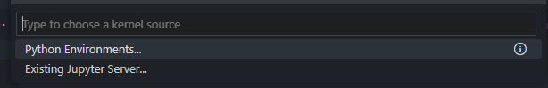
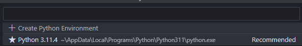
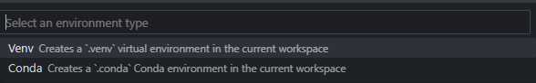
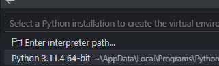
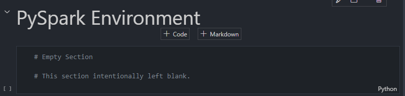
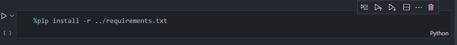
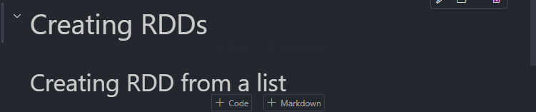
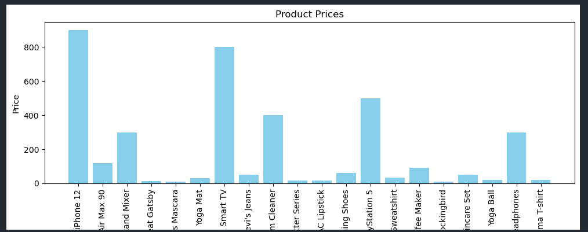

# 💻Sesión de Entrenamiento: Aprovechando GitHub Copilot para Ingeniería de Datos

## Introducción

Durante esta sesión práctica, los participantes experimentarán cómo GitHub Copilot puede ayudar a mejorar sus flujos de trabajo de ingeniería de datos. La sesión demostrará procesos esenciales de ingeniería de datos utilizando Python, Apache Spark y SQL, todo dentro de Jupyter Notebooks en VS Code. Los participantes también aprenderán cómo GitHub Copilot puede ayudar a generar consultas y documentación.

## 🎯Objetivos

- Ingesta de datos de varios orígenes mediante Apache Spark.
- Transformar datos usando PySpark y pandas.
- Generar consultas SQL con la asistencia de GitHub Copilot.
- Usar GitHub Copilot para ayudar a escribir código y generar documentación.
- Compartir el contexto del desarrollo previo y colaborar usando GitHub Copilot Chat.

## ℹ️Requisitos

- VS Code
- Licencia de GitHub Copilot
- Extensión de GitHub Copilot
- Python (venv)
- Versión de VS Code con Jupyter habilitado.

## Antes de comenzar la actividad: Clonar el repositorio

## Operaciones RDD

### Paso 1: Crear el archivo de Operaciones RDD y configurar el entorno PySpark

Usa el comando `/newNotebook` para crear un cuaderno Jupyter vacío.

👤 Prompt:

```
@workspace /newNotebook Crea un notebook de Jupyter sin contenido
```
**Nota**: En las ultimas versiones de GitHub Copilot / VS code, el participante @workspace, ya no se encuentra disponible, en estos casos debiera bastar con el comando `/newNotebook` para crear un nuevo cuaderno de Jupyter.

1.  

2.  

Renombra el archivo a `RDD-Operations.ipynb` y muévelo a la carpeta `notebooks`

## ⚠️ Crear Entorno Virtual de Python

Para esta primera actividad, necesitamos crear un entorno virtual de Python. Este paso es esencial porque nos permite aislar las dependencias del proyecto, asegurando que cualquier biblioteca o paquete que instalemos no interfiera con otros proyectos o con el entorno global de Python.

Solo necesitaremos crear este entorno virtual una vez al comienzo de la actividad. Después de eso, utilizaremos este entorno para el resto de las tareas, lo que significa que cada vez que ejecutemos o modifiquemos el código, se utilizarán los paquetes y configuraciones contenidas dentro de este entorno. Esto ayuda a mantener nuestro espacio de trabajo limpio y asegura consistencia a lo largo de la actividad.

1. Haz clic en `Seleccionar Kernel` en la parte superior derecha de la ventana

   

2. Selecciona `Entornos de Python`

   

3. Selecciona `Crear Entornos de Python`

   

4. Selecciona `Venv`

   

5. Selecciona una Instalación de Python

   

### Continuando con la actividad

### Establece el título a `Entorno PySpark`



Agrega una sección de código con el siguiente bloque de código, luego ejecuta esta celda. Esto instalará todos los paquetes necesarios para la actividad.

ℹ️ Solo necesitas ejecutar esta celda una vez para toda la actividad.

```python
%pip install -r ../requirements.txt
```



```python
# Establecer variables de entorno para PySpark
# Las variables deben configurar el directorio de Spark, Jupyter como el controlador y Python como el intérprete.
# Además, asegúrate de que Jupyter notebook se utilice como el entorno del controlador.

import os
os.environ['SPARK_HOME'] = "<Set the path to pyspark installation (.venv)>"
os.environ['PYSPARK_DRIVER_PYTHON'] = 'jupyter'
os.environ['PYSPARK_DRIVER_PYTHON_OPTS'] = 'notebook'
os.environ['PYSPARK_PYTHON'] = 'python'
```

### Paso 2: Inicializar la Sesión de Spark

Indica a Copilot que importe e inicialice la Sesión de Spark y luego cree una Sesión de Spark usando el desarrollo impulsado por comentarios

```python
# Importar Spark Session de pyspark.sql

from pyspark.sql import SparkSession

# Crear una SparkSession
spark = SparkSession.builder.appName('SparkRDD').getOrCreate()

```

### Paso 3: Crear RDD desde una lista

Crea un título `Creando RDDs` y luego un subtítulo `Crear RDD desde una lista`



```python

# Crear un RDD desde una lista de números del 1 al 10
data = [1, 2, 3, 4, 5, 6, 7, 8, 9, 10]
rdd = spark.sparkContext.parallelize(data)

# Realizar una acción de collect para ver los datos
rdd.collect()

```

### Paso 4: Crear RDD desde una lista de tuplas

```python
# Crear un RDD desde una lista de tuplas con nombre y edad entre 20 y 49
data = [('John', 25), ('Lisa', 28), ('Saul', 49), ('Maria', 35), ('Lee', 40)]
rdd = spark.sparkContext.parallelize(data)

# Realizar una acción de collect para ver los datos
rdd.collect()

```
### Paso 5: Transformación Map de RDD

Crea un título `Transformaciones de RDDs` y luego un subtítulo `Transformación Map`

```python
# Transformación Map: Convertir el nombre a mayúsculas
mappedData = rdd.map(lambda x: (x[0].upper(), x[1]))

# Realizar una acción de collect para ver los datos
mappedData.collect()

```

### Paso 6: Transformación Filter de RDD

Crea un subtítulo `Transformación Filter`

```python
# Transformación Filter: Filtrar registros con edad mayor a 30
filteredData = rdd.filter(lambda x: x[1] > 30)

# Realizar una acción de collect para ver los datos
filteredData.collect()


```
### Paso 7: Transformación ReduceByKey de RDD

Crea un subtítulo `Transformación ReduceByKey`

Pide a GitHub Copilot Chat que te dé un ejemplo de transformación ReduceByKey de RDD

👤Prompt:

```
Por favor, dame un ejemplo de transformación reduce by key de RDD, usa la sesión de spark y toma como referencia el archivo #file:RDD-Operations.ipynb
```

🤖 Respuesta de Copilot:

```python
# Establecer variables de entorno para PySpark
import os

os.environ['SPARK_HOME'] = '<Set the path to pyspark installation (.venv)>'
os.environ['PYSPARK_DRIVER_PYTHON'] = 'jupyter'
os.environ['PYSPARK_DRIVER_PYTHON_OPTS'] = 'notebook'
os.environ['PYSPARK_PYTHON'] = 'python'

# Import Spark Session from pyspark.sql
from pyspark.sql import SparkSession

# Crear una SparkSession
spark = SparkSession.builder.appName('SparkRDD').getOrCreate()

# Create an RDD from a list of tuples with name and age
data = [('John', 25), ('Lisa', 28), ('Saul', 49), ('Maria', 35), ('Lee', 40), ('John', 30), ('Lisa', 25)]
rdd = spark.sparkContext.parallelize(data)

# ReduceByKey: Calcular la edad total para cada nombre
reducedData = rdd.reduceByKey(lambda x, y: x + y)

# Realizar una acción de collect para ver los datos
result = reducedData.collect()
print(result)
```

> ⚠️ Vamos a tomar solo el bloque de código que necesitamos.

```python
data = [('John', 25), ('Lisa', 28), ('Saul', 49), ('Maria', 35), ('Lee', 40), ('John', 30), ('Lisa', 25)]
rdd = spark.sparkContext.parallelize(data)

# ReduceByKey: Calcular la edad total para cada nombre
reducedData = rdd.reduceByKey(lambda x, y: x + y)

# Realizar una acción de collect para ver los datos
reducedData.collect()
```

### Paso 8: Transformación SortBy de RDD

Crea un subtítulo `Transformación SortBy`

```python
# Transformación SortBy: Ordenar los datos por edad en orden descendente
sortedData = reducedData.sortBy(lambda x: x[1], ascending=False)

# Realizar una acción de collect para ver los datos
sortedData.collect()
```

## Operaciones de DataFrame

### Paso 1: Crear el archivo de Operaciones de DataFrame y configurar el entorno PySpark

Indica a Copilot que cree un nuevo cuaderno

👤 Prompt:

```
/newNotebook Genera un cuaderno Jupyter con 1 celda con el título "Entorno PySpark"
```
Renombra el archivo creado a `DataFrame-Operations.ipynb` y guárdalo en la carpeta notebooks.

Establecer la configuración de Spark

```python

import os
os.environ['SPARK_HOME'] = "<Set the path to pyspark installation (.venv)>"
os.environ['PYSPARK_DRIVER_PYTHON'] = 'jupyter'
os.environ['PYSPARK_DRIVER_PYTHON_OPTS'] = 'lab'
os.environ['PYSPARK_PYTHON'] = 'python'
```

### Paso 2: Inicializar la Sesión de Spark

Indica a Copilot que importe e inicialice la Sesión de Spark y luego cree una Sesión de Spark usando el desarrollo impulsado por comentarios

```python
# Importar PySpark e inicializar SparkSession
from pyspark.sql import SparkSession

# Crear una SparkSession
spark = SparkSession.builder.appName('SparkSQL').getOrCreate()
```

### Paso 3: Leer archivo CSV en DataFrame

Crea un título `Leer archivo CSV en DataFrame` y un subtítulo `Leer CSV con encabezado`

#### Leer CSV con encabezado

Indica a Copilot cómo leer un archivo CSV en un DataFrame

👤Prompt:

```
@workspace Quiero leer un archivo CSV en un DataFrame, luego imprimir el esquema del DataFrame y mostrar los datos. El archivo a leer es #file:products.csv
```

**Nota**: También puedes usar el modo agente para este paso, lo que te permitirá interactuar con GitHub Copilot Chat y pedirle que te ayude a escribir el código.

Ejemplo de prompt para modo agente:

```Leer el siguiente archivo CSV en un DataFrame, luego imprimir el esquema del DataFrame y mostrar los datos. El archivo a leer es #file:products.csv```

🤖 Respuesta de Copilot:

```python
from pyspark.sql import SparkSession

# Inicializar SparkSession
spark = SparkSession.builder.appName('ProductsDataFrame').getOrCreate()

# Leer el archivo CSV en un DataFrame
df = spark.read.csv('data/products.csv', header=True, inferSchema=True)

# Imprimir el esquema del DataFrame
df.printSchema()

# Mostrar los datos
df.show()
```

> ℹ️ Usamos solo el código que necesitamos y establecemos la ruta correcta al archivo.

```python
# Leer el archivo CSV en un DataFrame
df = spark.read.csv('../data/products.csv', header=True, inferSchema=True)

# Imprimir el esquema del DataFrame
df.printSchema()

# Mostrar los datos
df.show()
```

#### Leer CSV con una definición de esquema explícita

Crea un subtítulo `Leer CSV con una definición de esquema explícita`

Indica a Copilot que lea el mismo archivo pero en este caso con una definición de esquema explícita

👤 Prompt:

```
Ahora lee el mismo archivo pero en este caso con una definición de esquema explícita
```


🤖 Respuesta de Copilot:

```python
from pyspark.sql import SparkSession
from pyspark.sql.types import StructType, StructField, IntegerType, StringType, DoubleType

# Inicializar SparkSession
spark = SparkSession.builder.appName('ProductsDataFrame').getOrCreate()

# Definir el esquema explícitamente
schema = StructType([
    StructField("id", IntegerType(), True),
    StructField("name", StringType(), True),
    StructField("category", StringType(), True),
    StructField("quantity", IntegerType(), True),
    StructField("price", DoubleType(), True)
])

# Leer el archivo CSV en un DataFrame con el esquema explícito
df = spark.read.csv('../data/products.csv', header=True, schema=schema)

# Imprimir el esquema del DataFrame
df.printSchema()

# Mostrar los datos
df.show()

```

> ℹ️ Usamos solo el código que necesitamos y establecemos la ruta correcta al archivo..

```python
from pyspark.sql.types import StructType, StructField, IntegerType, StringType, DoubleType

# Definir el esquema explícitamente
schema = StructType([
    StructField("id", IntegerType(), True),
    StructField("name", StringType(), True),
    StructField("category", StringType(), True),
    StructField("quantity", IntegerType(), True),
    StructField("price", DoubleType(), True)
])

# Leer el archivo CSV en un DataFrame con el esquema explícito
df = spark.read.csv('../data/products.csv', header=True, schema=schema)

# Imprimir el esquema del DataFrame
df.printSchema()

# Mostrar los datos
df.show()
```

### Paso 4: Leer archivo JSON en DataFrame

Crea un título `Leer archivo JSON en DataFrame` y un subtítulo `JSON de una sola línea`

#### JSON de una sola línea

Indica a Copilot cómo leer un archivo JSON de una sola línea en un DataFrame

👤 Prompt:

```
@workspace cómo leer un JSON de una sola línea en un DataFrame e imprimir el esquema y los datos del DataFrame. El archivo a leer es #file:products_singleline.json
```

🤖 Respuesta de Copilot:

```python
from pyspark.sql import SparkSession

# Inicializar SparkSession
spark = SparkSession.builder.appName('ProductsDataFrame').getOrCreate()

# Leer el archivo JSON de una sola línea en un DataFrame
df = spark.read.json('data/products_singleline.json')

# Imprimir el esquema del DataFrame
df.printSchema()

# Mostrar los datos
df.show()
```

> ℹ️ Establece la ruta correcta al archivo

#### JSON de múltiples líneas

Crea un subtítulo `JSON de múltiples líneas`

Indica a Copilot cómo leer un archivo JSON de múltiples líneas en un DataFrame.

👤 Prompt:

```
@workspace cómo leer un archivo JSON de múltiples líneas en un DataFrame e imprimir el esquema y los datos del DataFrame. El archivo a leer es #file:products_multiline.json
```

🤖Respuesta de Copilot:

```python
from pyspark.sql import SparkSession

# Initialize SparkSession
spark = SparkSession.builder.appName('ProductsDataFrame').getOrCreate()

# Read the multi-line JSON file into a DataFrame
df = spark.read.json('data/products_multiline.json', multiLine=True)

# Print the DataFrame schema
df.printSchema()

# Show the data
df.show()
```

> ℹ️ Establece la ruta correcta al archivo

```python
# Leer JSON de múltiples líneas
# Usa el método json de spark para leer JSON de múltiples líneas con la opción multiline
json_file = '../data/products_multiline.json'
df = spark.read.json(json_file, multiLine=True)

# Mostrar el esquema del DataFrame
df.printSchema()

# Mostrar las primeras 20 filas
df.show()
```

### Paso 5: Crear un Gráfico de Barras

Crea un subtítulo `Crear un gráfico de barras`

Indica a Copilot cómo crear un gráfico de barras usando un DataFrame de pandas

👤Prompt:

```
@workspace Cómo convertir un DataFrame a un DataFrame de pandas y luego crear un gráfico de barras con los precios de los productos usando matplotlib
```

🤖 Respuesta de Copilot:

```python
import matplotlib.pyplot as plt

# Asumiendo que ya has leído el archivo JSON en un DataFrame de PySpark
df = spark.read.json('../data/products_singleline.json')

# Convertir el DataFrame de PySpark a un DataFrame de Pandas
pandas_df = df.toPandas()

# Crear un gráfico de barras con los precios de los productos
plt.figure(figsize=(10, 6))
plt.bar(pandas_df['name'], pandas_df['price'], color='skyblue')
plt.xlabel('Product Name')
plt.ylabel('Price')
plt.title('Product Prices')
plt.xticks(rotation=90)
plt.tight_layout()

# Mostrar el gráfico
plt.show()
```



### Paso 6: Operaciones de DataFrame

Crea un título `Operaciones de DataFrame` y un subtítulo `Cargar los datos sintéticos en DataFrame`

#### Cargar los datos sintéticos en DataFrame

Indica a Copilot que lea el archivo sintético `stocks.txt` en un DataFrame

👤 Prompt:

```
@workspace Lee este archivo sintético en un DataFrame, imprime el esquema y los datos. El archivo es #file:stocks.txt
```

🤖 Respuesta de Copilot:

```python
from pyspark.sql import SparkSession

# Inicializar SparkSession
spark = SparkSession.builder.appName('StocksDataFrame').getOrCreate()

# Leer el archivo CSV en un DataFrame
df = spark.read.csv('data/stocks.txt', header=True, inferSchema=True)

# Imprimir el esquema del DataFrame
df.printSchema()

# Mostrar los datos
df.show()
```

> ℹ️ Establece la ruta correcta al archivo

#### Select: Elegir columnas específicas

Crea un subtítulo `Select: Elegir columnas específicas`

```python
# Seleccionar columnas específicas del DataFrame: name, category, y price
df.select('name', 'category', 'price').show()
```

#### Filter: Aplicar condiciones para filtrar filas

Crea un subtítulo `Filter: Aplicar condiciones para filtrar filas`

```python
# Filtrar filas basadas en una condición usando el método filter
df.filter(df['price'] > 100).show()
```

#### GroupBy: Agrupar datos basados en columnas específicas

Crea un subtítulo `GroupBy: Agrupar datos basados en columnas específicas`

```python
# Agrupar por categoría y contar el número de productos en cada categoría
df.groupBy('category').count().show()

# Agregar agregaciones como sum, avg, max, min, etc.
df.groupBy('category').agg({'price': 'avg'}).show()
```

#### Join: Combinar múltiples DataFrames basados en columnas específicas

Crea un subtítulo `Join: Combinar múltiples DataFrames basados en columnas específicas`

```python
# Join con otro DataFrame. Crea este nuevo DF filtrando el DataFrame original
df2 = df.filter(df['price'] > 100)

# Unir los dos DataFrames
df.join(df2, on='category', how='inner').show()
```

#### WithColumn: Agregar nuevas columnas calculadas

Crea un subtítulo `WithColumn: Agregar nuevas columnas calculadas`

```python
# Agregar una nueva columna calculada
df.withColumn('price_after_tax', df['price'] * 1.1).show()
```

## Spark SQL

### Paso 1: Crear archivo de Spark SQL y configurar el entorno PySpark

Indica a Copilot que cree un nuevo cuaderno

👤 Prompt:

```
@workspace /newNotebook Genera un notebook Jupyter con 1 celda con el título "Entorno PySpark"
```

Renombra el archivo creado a `Spark-SQL.ipynb` y guárdalo en la carpeta notebooks.

Establecer la configuración de Spark

```python

import os
os.environ['SPARK_HOME'] = "<Set the path to pyspark installation (.venv)>"
os.environ['PYSPARK_DRIVER_PYTHON'] = 'jupyter'
os.environ['PYSPARK_DRIVER_PYTHON_OPTS'] = 'lab'
os.environ['PYSPARK_PYTHON'] = 'python'
```

Indica a Copilot que importe e inicialice la Sesión de Spark y luego cree una Sesión de Spark usando el desarrollo impulsado por comentarios

```python
# Importar PySpark e inicializar SparkSession
from pyspark.sql import SparkSession

# Crear una SparkSession
spark = SparkSession.builder.appName('SparkSQL').getOrCreate()
```

### Paso 2: Cargar datos en un DataFrame

Crea un título `Spark SQL` y un subtítulo `Cargar datos en un DataFrame`

Indica a Copilot cómo cargar datos sintéticos en un DataFrame

👤Prompt:

```
@workspace Cómo cargar datos sintéticos en un DataFrame, imprimir el esquema y mostrar las primeras 5 filas. El archivo a cargar es #file:persons.csv
```

🤖 Respuesta de Copilot:

```python
from pyspark.sql import SparkSession

# Inicializar SparkSession
spark = SparkSession.builder.appName('PersonsDataFrame').getOrCreate()

# Leer el archivo CSV en un DataFrame
df = spark.read.csv('data/persons.csv', header=True, inferSchema=True)

# Imprimir el esquema del DataFrame
df.printSchema()

# Mostrar las primeras 5 filas
df.show(5)

```

> ℹ️ Establece la ruta correcta al archivo.

🤖 Respuesta de Copilot:

```python
from pyspark.sql import SparkSession

# Inicializar SparkSession
spark = SparkSession.builder.appName('PersonsDataFrame').getOrCreate()

# Leer el archivo CSV en un DataFrame
df = spark.read.csv('../data/persons.csv', header=True, inferSchema=True)

# Imprimir el esquema del DataFrame

df.printSchema()

# Mostrar las primeras 5 filas
df.show(5)

```

> ℹ️ Establece la ruta correcta al archivo.

### Paso 3: Registrar el DataFrame como una Tabla Temporal

Crea un subtítulo `Registrar el DataFrame como una Tabla Temporal`

```python
# Registrar el DataFrame como una Tabla Temporal
df.createOrReplaceTempView('persons')
```

### Paso 4: Realizar Consultas SQL

Crea un subtítulo `Realizar Consultas SQL`

```python
# Seleccionar todas las filas donde la edad sea mayor a 25
query = 'SELECT * FROM persons WHERE age > 25'
result = spark.sql(query)
result.show()

# Calcular el salario promedio de las personas
query = 'SELECT AVG(salary) AS avg_salary FROM persons'
result = spark.sql(query)
result.show()
```

### Paso 5: Gestionar vistas temporales

Crea un subtítulo `Gestionar vistas temporales`

```python
# Verificar si existe una vista temporal llamada persons y mostrar un mensaje si existe
if spark.catalog._jcatalog.tableExists('persons'):
    print('Temporary view persons exists')

# Eliminar la vista temporal persons
spark.catalog.dropTempView('persons')

# Verificar si existe una vista temporal
if spark.catalog._jcatalog.tableExists('persons'):
    print('The temporary view persons exists')
```

### Paso 6: Subconsultas

Crea un subtítulo `Subconsultas`

```python
# Crear dos DataFrames
# El primer DataFrame contiene datos de empleados con columnas: id, name
# El segundo DataFrame contiene datos de salarios con columnas: id, salary, department
emp_data = [(1, 'John'), (2, 'Jane'), (3, 'Smith')]
salary_data = [(1, 50000, 'HR'), (2, 60000, 'IT'), (3, 70000, 'Finance')]
emp_df = spark.createDataFrame(emp_data, ['id', 'name'])
salary_df = spark.createDataFrame(salary_data, ['id', 'salary', 'department'])


# Mostrar los DataFrames
emp_df.show()
salary_df.show()

```

```python
# Registrar como vistas temporales
emp_df.createOrReplaceTempView('employees')
salary_df.createOrReplaceTempView('salaries')
```

```python
# Subconsulta para encontrar empleados con salarios por encima del promedio
query = '''
SELECT e.name, s.salary
FROM employees e
JOIN salaries s
ON e.id = s.id
WHERE s.salary > (SELECT AVG(salary) FROM salaries)
'''
result = spark.sql(query)
result.show()
```

#### Recursos

1. https://www.oreilly.com/library/view/prompt-engineering-for/9781098153427/
